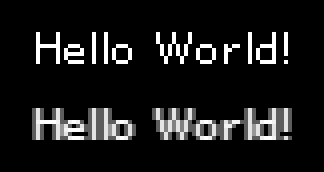

 <div align="center">

  <h2>pixel-text</h2>
  <blockquote>Render bitmap pixel fonts to canvas without anti-aliasing!</blockquote>
  <br/>

  
  
  *top is `pixel-text`, bottom is canvas's default `fillText`*

  [🔠 You can find some nice bitmap fonts here 🔠](http://www.pentacom.jp/pentacom/bitfontmaker2/gallery/)
</div>

---

## 📦 Getting Started

1. Build a `png` with `Divo compatible xml` for the font of your choice using [**andryblack/fontbuilder**](https://github.com/andryblack/fontbuilder)
2. Install the pixel-text module
```
npm install pixel-text --save
```
3. Start rendering!
```js
const PixelText = require('pixel-text');

const canvas = document.getElementById('demo-canvas');
const font = await PixelText.loadFont(
  '/helvetipixel_medium_16.png',
  '/helvetipixel_medium_16.xml'
);
const textRenderer = new PixelText.Renderer({
  font,
  canvas
});

textRenderer.draw(0, 0, 'Hello World!');
```

## ⚙️ API

### `PixelText.loadFont`(pngSrc, xmlUrl)
*Returns Promise with font object*

---

### new `PixelText.Renderer`(options)

**options** - Object of renderer options

**options.font** - Font object returned by `PixelText.loadFont`.

**options.canvas** - Canvas element to draw on.

**options.color** - Default text color. *default `'white'`*

**options.colorSymbols** - Symbols used to change text color. *default:*
```js
colorSymbols: {
  '🔵': 'blue',
  '⚪': 'white',
  '🔴': 'red',
  '🟠': 'orange',
  '🟣': 'purple',
  '🟤': 'brown',
  '🟡': 'yellow',
  '🟢': 'green',
  '⚫': 'black'
}
```

---

### `PixelText.Renderer.draw`(x, y, text, options)


**x** - `x` position to draw text.

**y** - `y` position to draw text.

**text** - Text value to draw.

**options** - Object of draw options.

**options.color** - Default text color. *default `'white'`*

**options.scale** - Scale multiplier. *default `1`*


## 💎 Todo

- [ ] Add bounding box to draw options
- [ ] Add vertical and horizontal text alignment to draw options
- [ ] Add wrapping to draw options